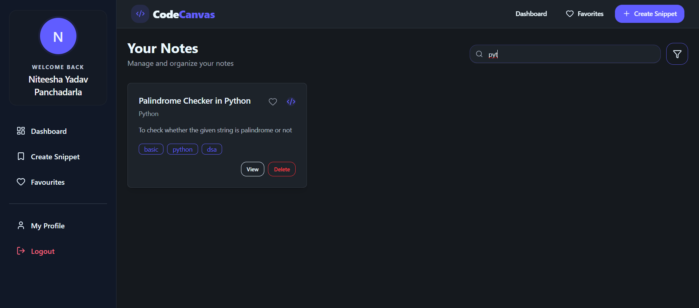
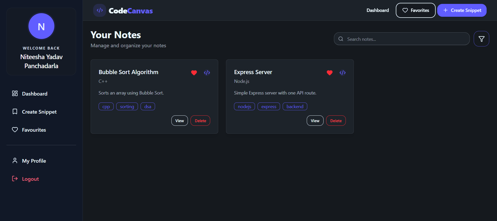

# 🚀 CodeCanvas

Full-Stack MERN Platform for Saving, Organizing & Searching Reusable Code Snippets

🔗 Live Site: https://codecanvas-dev.vercel.app
🔗 GitHub Repository: https://github.com/niteeshayadav/codecanvas
---

## Screenshots

> *(Add screenshots here — see `/screenshots` folder)*

| Dashboard | Create Snippet |
|---|---|
|  |  |

| Search & Filter | Snippet Details |
|---|---|
|  |  |

| Favourites | Profile |
|---|---|
|  |  |

---

## 📖 About

CodeCanvas is a full-stack MERN platform designed for saving, organizing, and searching reusable code snippets through a secure and intuitive workspace.
The platform enables users to create, edit, search, filter, and manage code snippets efficiently while maintaining personalized and secure access to their data. With support for language-based categorization, tag-based organization, advanced search capabilities, and favorite snippets management, CodeCanvas helps users quickly retrieve and reuse frequently used code.
The application implements secure JWT authentication, protected routes, HTTP-only cookies, rate limiting, token blacklisting, and optimized search functionality to deliver both security and performance.

---

## Tech Stack

| Layer | Technologies |
|---|---|
| **Frontend** | React 19, Vite, Tailwind CSS v4, DaisyUI, React Router v7 |
| **Code Editor** | Monaco Editor (`@monaco-editor/react`) |
| **Backend** | Node.js, Express 5, REST API |
| **Database** | MongoDB Atlas, Mongoose |
| **Auth** | JWT, httpOnly cookies, bcryptjs, token blacklisting |
| **Other** | Axios, React Hot Toast, Lucide React, express-rate-limit |
| **Deployment** | Vercel (Frontend), Render (Backend) |

---

## Features

**Authentication & Security**
- JWT auth via httpOnly cookies with environment-aware `secure` and `sameSite` flags
- Token blacklisting on logout with MongoDB TTL index (auto-expires in 7 days)
- Rate limiting on auth routes — 10 requests / 15-min window per IP
- bcrypt password hashing, protected routes, user-scoped data access

**Snippet Management**
- Full CRUD — create, view, edit, delete snippets
- Pin / favourite snippets with optimistic UI update
- Snippets scoped to authenticated user via ownership validation

**Search & Filtering**
- Real-time debounced search (300ms) across title, language, description, and code
- Multi-criteria filter modal — language, tags, and favourites simultaneously
- Instant reset to full fetch when search query is cleared

**Code Editing Experience**
- Monaco Editor (VS Code) in editable mode for creating/editing snippets
- Monaco in read-only mode with syntax highlighting for viewing snippets
- Responsive fallback to `<textarea>` on mobile — 10 supported languages

---

## Architecture

```
┌─────────────────────────────────────────────┐
│              React Frontend                  │
│         (Vite + Tailwind + DaisyUI)          │
│                                              │
│  ┌──────────┐  ┌────────────┐  ┌──────────┐ │
│  │  Pages   │  │ Components │  │ Context  │ │
│  │Dashboard │  │SnippetForm │  │   Auth   │ │
│  │Favourites│  │SnippetsGrid│  │ Context  │ │
│  │ Profile  │  │FilterModal │  └──────────┘ │
│  └──────────┘  └────────────┘               │
│                                              │
│  ┌──────────────────────────────────────┐    │
│  │    Axios Instance (withCredentials)  │    │
│  │  authService.js | snippetService.js  │    │
│  └─────────────────┬────────────────────┘    │
└────────────────────│────────────────────────-┘
                     │ HTTP + httpOnly Cookie
┌────────────────────▼───────────────────────┐
│             Express REST API                │
│           (Node.js + Express 5)             │
│                                             │
│  ┌──────────────────────────────────────┐   │
│  │      Rate Limiter (auth only)        │   │
│  │    10 requests / 15 min / IP         │   │
│  └─────────────────┬────────────────────┘   │
│                    │                        │
│  ┌─────────────────▼────────────────────┐   │
│  │    authenticatedUser Middleware      │   │
│  │      JWT verify + Blacklist check    │   │
│  └─────────────────┬────────────────────┘   │
│                    │                        │
│  ┌─────────────────▼────────────────────┐   │
│  │            Controllers               │   │
│  │  auth.controller | snippet.controller│   │
│  └─────────────────┬────────────────────┘   │
└────────────────────│───────────────────────-┘
                     │ Mongoose ODM
┌────────────────────▼───────────────────────┐
│               MongoDB Atlas                 │
│                                             │
│    users  │  snippets  │  blacklist(TTL)    │
└─────────────────────────────────────────────┘
```

---

## Folder Structure

```
CodeCanvas/
│
├── Backend/
│   ├── server.js                        # Entry point — DB connect + app listen
│   └── src/
│       ├── app.js                       # Express app, CORS, middleware setup
│       ├── config/
│       │   └── database.js              # MongoDB connection
│       ├── controllers/
│       │   ├── auth.controller.js       # register, login, logout, getMe
│       │   └── snippet.controller.js    # CRUD, search, pin/unpin
│       ├── middlewares/
│       │   ├── auth.middleware.js       # JWT verify + blacklist check
│       │   └── error.middleware.js      # Global error handler
│       ├── models/
│       │   ├── user.model.js
│       │   ├── snippet.model.js
│       │   └── blacklist.model.js       # TTL index: auto-expires in 7 days
│       └── routes/
│           ├── auth.routes.js           # Rate-limited auth endpoints
│           └── snippet.routes.js        # /search registered before /:id
│
└── Frontend/
    ├── index.html
    ├── vite.config.js
    ├── vercel.json
    └── src/
        ├── App.jsx                      # Route definitions (8 protected routes)
        ├── main.jsx
        ├── index.css
        ├── components/
        │   ├── SnippetForm.jsx          # Monaco (lg+) / textarea (mobile)
        │   ├── SnippetsGrid.jsx         # Debounced search + filter + pin
        │   ├── FilterModal.jsx          # Language, tag, favourites filter
        │   ├── ConfirmDeleteModal.jsx   # Delete confirmation with title preview
        │   ├── Navbar.jsx
        │   ├── SideBar.jsx
        │   ├── Layout.jsx
        │   ├── ProtectedRoute.jsx       # Redirects unauthenticated users
        │   └── PublicRoute.jsx          # Redirects authenticated users
        ├── context/
        │   └── AuthContext.jsx          # Global auth state
        ├── pages/
        │   ├── Dashboard.jsx
        │   ├── CreateSnippet.jsx
        │   ├── EditSnippet.jsx
        │   ├── SnippetDetails.jsx       # Monaco read-only viewer
        │   ├── Favourites.jsx
        │   ├── ProfilePage.jsx          # GitHub-dark profile card
        │   ├── Login.jsx
        │   └── Register.jsx
        └── services/
            ├── api.js                   # Axios instance (withCredentials: true)
            ├── authService.js
            └── snippetService.js
```

---

## API Reference

### Auth — `/api/auth` *(rate-limited: 10 req / 15 min per IP)*

| Method | Endpoint | Description | Access |
|--------|----------|-------------|--------|
| `POST` | `/register` | Register new user | Public |
| `POST` | `/login` | Login, sets httpOnly cookie | Public |
| `POST` | `/logout` | Clears cookie, blacklists token | Public |
| `GET` | `/me` | Get current user details | Private |

### Snippets — `/api/snippets`

| Method | Endpoint | Description | Access |
|--------|----------|-------------|--------|
| `GET` | `/` | Get all snippets (`?language=`, `?tags=`, `?favouritesOnly=true`) | Private |
| `GET` | `/search?q=` | Full-text search across 4 fields | Private |
| `POST` | `/` | Create snippet | Private |
| `GET` | `/:id` | Get snippet by ID | Private |
| `PATCH` | `/:id` | Update snippet | Private |
| `DELETE` | `/:id` | Delete snippet | Private |
| `PATCH` | `/:id/pin` | Toggle pin/favourite | Private |

---

## Getting Started

### Prerequisites

- Node.js v18+
- MongoDB (local or Atlas)

### Backend

```bash
cd Backend
npm install
```

Create a `.env` file:

```env
PORT=3000
MONGO_URI=your_mongodb_connection_string
JWT_SECRET=your_jwt_secret
CLIENT_URL=http://localhost:5173
NODE_ENV=development
```

```bash
npm run dev
```

### Frontend

```bash
cd Frontend
npm install
npm run dev
```

Open `http://localhost:5173`

---

## Design Decisions

**Why httpOnly cookies instead of localStorage for JWT?**
Tokens in localStorage are accessible to JavaScript, making them vulnerable to XSS. httpOnly cookies cannot be read by client-side scripts. Combined with `SameSite: None; Secure` in production, this significantly reduces the attack surface.

**Why token blacklisting on logout?**
JWTs are stateless — once issued, they're valid until expiry. Without a blacklist, a logged-out token could still be used if intercepted. The blacklist collection with a MongoDB TTL index handles automatic cleanup without any external scheduler.

**Why a Monaco fallback on mobile?**
Monaco requires a known-height container and doesn't reflow naturally on small screens. The component detects viewport width (`window.innerWidth >= 1024`) and renders a plain `<textarea>` on mobile — same data model, no broken editor.

**Why debounce on search?**
Without debounce, each character typed triggers an API call. A 300ms debounce fires the request only after the user pauses, reducing redundant backend load by up to 90%.

**Why `/search` registered before `/:id`?**
Express matches routes top-down. If `/:id` is registered first, the literal string `"search"` is captured as a dynamic parameter and the search endpoint is never reached. Registering `/search` first ensures correct routing.

---

## 👨‍💻 Author

Panchadarla V Sai Niteesha Yadav

B.Tech - Information Technology
Andhra University College of Engineering

📧 niteeshayadav66@gmail.com
🔗 LinkedIn: https://linkedin.com/in/niteeshayadav
💻 GitHub: https://github.com/niteeshayadav

⭐ If you found this project useful, consider giving it a star
