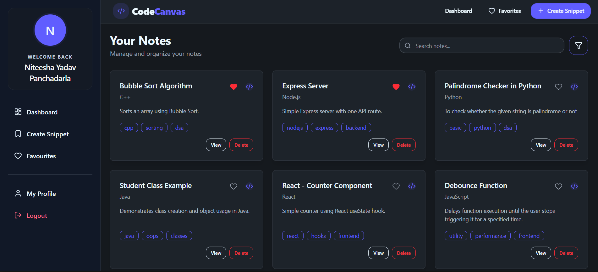
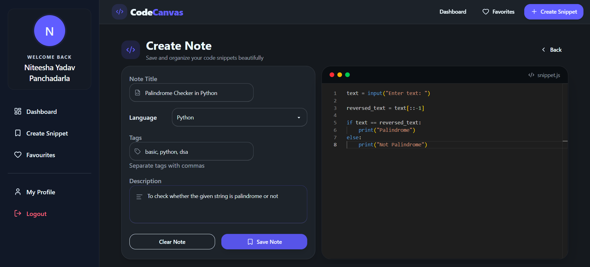
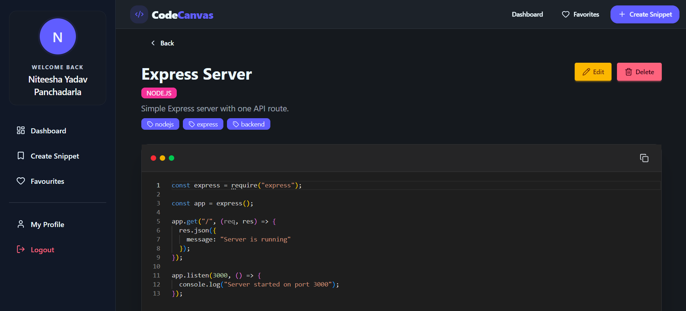
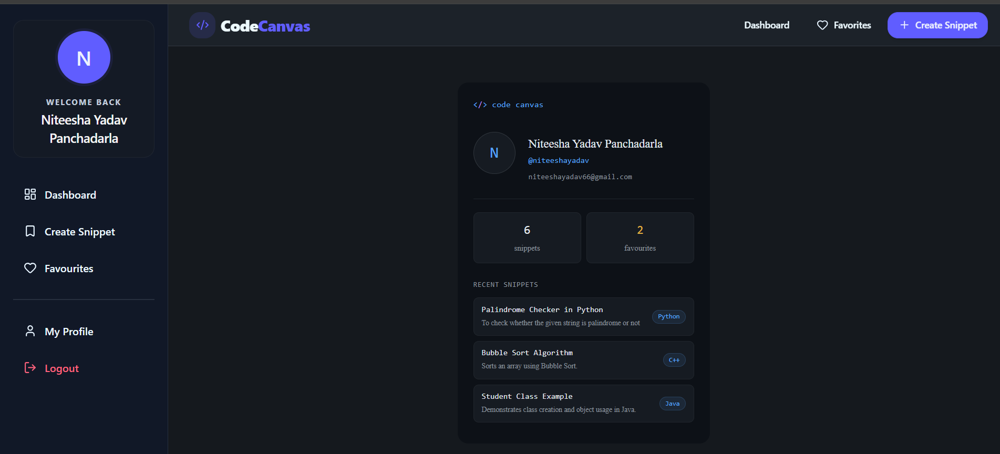

# 🚀 CodeCanvas

<div align="center">

### Full-Stack MERN Platform for Saving, Organizing & Searching Reusable Code Snippets

<p align="center">
  
  
  
  
  
  
  
</p>

<p align="center">
  
  
  
  
  
  
  
</p>

<p align="center">
  
  
  
  
  
  
  
</p>


</div>

---

### 🌐 Live Demo

🔗 Live Site: https://codecanvas-dev.vercel.app

🔗 GitHub Repository: https://github.com/niteeshayadav/codecanvas

---

## 📖 About

CodeCanvas is a full-stack MERN platform designed for saving, organizing, and searching reusable code snippets through a secure and intuitive workspace.

The platform enables users to create, edit, search, filter, and manage code snippets efficiently while maintaining personalized and secure access to their data. With support for language-based categorization, tag-based organization, advanced search capabilities, and favorites management, CodeCanvas helps users quickly retrieve and reuse frequently used code.

Built using React.js, Node.js, Express.js, and MongoDB, the application combines a modern frontend experience with a scalable backend architecture while emphasizing security, performance, and maintainability.

---

## ✨ Features

### 🔐 Authentication & Security

- JWT Authentication & Authorization
- HTTP-only Cookie-Based Sessions
- Protected Routes
- Password Hashing with bcrypt
- Secure Logout Mechanism
- Token Blacklisting
- Authentication Rate Limiting

### 📝 Snippet Management

- Create, Edit, and Delete Snippets
- User-Specific Snippet Storage
- Detailed Snippet View
- Pin-to-Favourites Functionality
- Secure CRUD Operations

### 🔍 Search & Organization

- Real-Time Search
- Multi-Field Regex Search
- Language-Based Filtering
- Tag-Based Filtering
- Debounced API Requests
- Instant Snippet Retrieval

### 💻 Code Editing Experience

- Monaco Editor Integration
- Multi-Language Syntax Highlighting
- Responsive UI
- Reusable Component Architecture

---

## 📸 Screenshots

> Explore the key features and user interface of CodeCanvas.

| Dashboard | Create Snippet | Snippet Details |
|------------|------------|------------|
|  |  |  |

| Search & Filter | Favorites | Profile |
|------------|------------|------------|
|  |  |  |

---

## 🛠️ Tech Stack

### Frontend

- React.js
- React Router DOM
- Axios
- Tailwind CSS
- DaisyUI
- Monaco Editor
- React Hot Toast

### Backend

- Node.js
- Express.js
- JWT Authentication
- bcryptjs
- Cookie Parser
- Express Rate Limit

### Database

- MongoDB Atlas
- Mongoose

### Deployment

- Vercel
- Render

---

## 🏗️ Architecture


## Folder Structure

```
CodeCanvas/
│
├── Backend/
│   ├── server.js                        # Entry point — DB connect + app listen
│   └── src/
│       ├── app.js                       # Express app, CORS, middleware setup
│       ├── config/
│       │   └── database.js              # MongoDB connection
│       ├── controllers/
│       │   ├── auth.controller.js       # register, login, logout, getMe
│       │   └── snippet.controller.js    # CRUD, search, pin/unpin
│       ├── middlewares/
│       │   ├── auth.middleware.js       # JWT verify + blacklist check
│       │   └── error.middleware.js      # Global error handler
│       ├── models/
│       │   ├── user.model.js
│       │   ├── snippet.model.js
│       │   └── blacklist.model.js       # TTL index: auto-expires in 7 days
│       └── routes/
│           ├── auth.routes.js           # Rate-limited auth endpoints
│           └── snippet.routes.js        # /search registered before /:id
│
└── Frontend/
    ├── index.html
    ├── vite.config.js
    ├── vercel.json
    └── src/
        ├── App.jsx                      # Route definitions (8 protected routes)
        ├── main.jsx
        ├── index.css
        ├── components/
        │   ├── SnippetForm.jsx          # Monaco (lg+) / textarea (mobile)
        │   ├── SnippetsGrid.jsx         # Debounced search + filter + pin
        │   ├── FilterModal.jsx          # Language, tag, favourites filter
        │   ├── ConfirmDeleteModal.jsx   # Delete confirmation with title preview
        │   ├── Navbar.jsx
        │   ├── SideBar.jsx
        │   ├── Layout.jsx
        │   ├── ProtectedRoute.jsx       # Redirects unauthenticated users
        │   └── PublicRoute.jsx          # Redirects authenticated users
        ├── context/
        │   └── AuthContext.jsx          # Global auth state
        ├── pages/
        │   ├── Dashboard.jsx
        │   ├── CreateSnippet.jsx
        │   ├── EditSnippet.jsx
        │   ├── SnippetDetails.jsx       # Monaco read-only viewer
        │   ├── Favourites.jsx
        │   ├── ProfilePage.jsx          # GitHub-dark profile card
        │   ├── Login.jsx
        │   └── Register.jsx
        └── services/
            ├── api.js                   # Axios instance (withCredentials: true)
            ├── authService.js
            └── snippetService.js
```

---

## ⚡ Performance Optimizations

### Debounced Search

Implemented conditional debounced API requests (300ms) to minimize unnecessary network requests while maintaining real-time responsiveness.

**Impact**

- Reduced redundant API calls by up to 90%
- Improved frontend responsiveness
- Reduced backend workload

### MongoDB TTL Index

Implemented TTL indexes for automatic expiration and cleanup of blacklisted JWT tokens.

**Benefits**

- Automatic token cleanup
- Reduced database maintenance
- Improved authentication efficiency

---

## 🚧 Engineering Challenges

### Real-Time Search Optimization

Implemented conditional debounced API requests to reduce redundant network requests while maintaining a responsive search experience.

### Secure JWT Logout

Built a token blacklist mechanism using MongoDB TTL indexes to immediately invalidate logged-out tokens while automatically cleaning expired entries.

### Authentication Security

Protected authentication routes using rate limiting to mitigate brute-force attacks and unauthorized access attempts.

### User-Specific Data Isolation

Implemented authorization middleware and ownership validation to ensure users can only access and manage their own snippets.

### Efficient Snippet Discovery

Designed multi-field regex search combined with language and tag-based filtering for fast and accurate snippet retrieval.

---

## 🚀 API Endpoints

### Authentication Routes

| Method | Endpoint | Description |
|----------|----------|-------------|
| POST | `/api/auth/register` | Register User |
| POST | `/api/auth/login` | Login User |
| POST | `/api/auth/logout` | Logout User |
| GET | `/api/auth/me` | Get Current User |

### Snippet Routes

| Method | Endpoint | Description |
|----------|----------|-------------|
| GET | `/api/snippets` | Get All Snippets |
| GET | `/api/snippets/:id` | Get Single Snippet |
| POST | `/api/snippets` | Create Snippet |
| PUT | `/api/snippets/:id` | Update Snippet |
| DELETE | `/api/snippets/:id` | Delete Snippet |

---

## ⚙️ Local Setup

### 1. Clone Repository

```bash
git clone https://github.com/your-username/codecanvas.git

cd codecanvas
```

### 2. Backend Setup

```bash
cd backend

npm install
```

Create a `.env` file:

```env
PORT=5000
MONGO_URI=your_mongodb_uri
JWT_SECRET=your_secret_key
CLIENT_URL=http://localhost:5173
```

Run Backend

```bash
npm run dev
```

### 3. Frontend Setup

```bash
cd frontend

npm install

npm run dev
```

---

## 👨‍💻 Author

**Panchadarla V Sai Niteesha Yadav**

B.Tech Information Technology  
Andhra University College of Engineering

📧 Email: niteeshayadav66@gmail.com

🔗 LinkedIn: https://www.linkedin.com/in/niteeshayadav

💻 GitHub: https://github.com/niteeshayadav

---

<div align="center">

⭐ If you found this project interesting, consider giving it a star!

</div>
